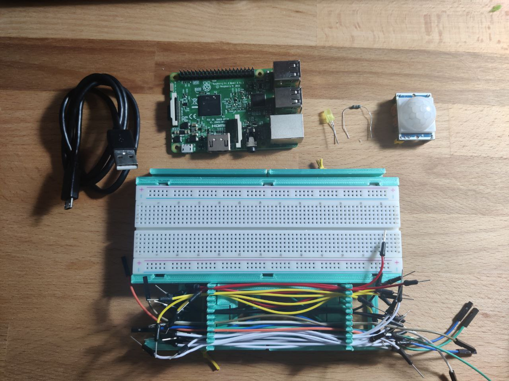
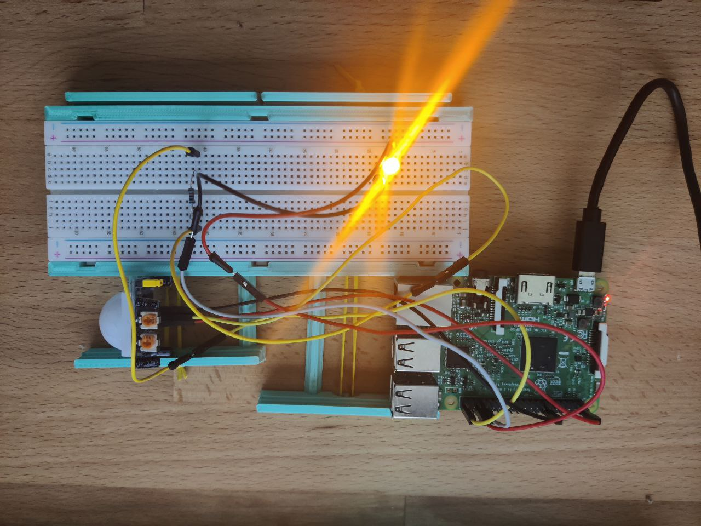

# Trigger a python script using a motion sensor(HC-SR501) on raspberry pi3

This script is extremely trivial but it can be really handy for automating
something.
I use this hardware because I needed to use this sensor to trigger other python
scripts on raspberry pi.
In this script the function to be triggered when the sensor is detected is
replaced by a 5 sec sleep ().
The LED turns on when movement is detected and turns off when the call is ended.

**components:**
  * raspberry pi3 (easily adaptable to any other version).
  * HC-SR501
  * yellow LED (any other LED is fine but pay attention to the resistances)
  * 10 KΩ resistor (It is only a precaution to protect the Pi GPIO inputs)
